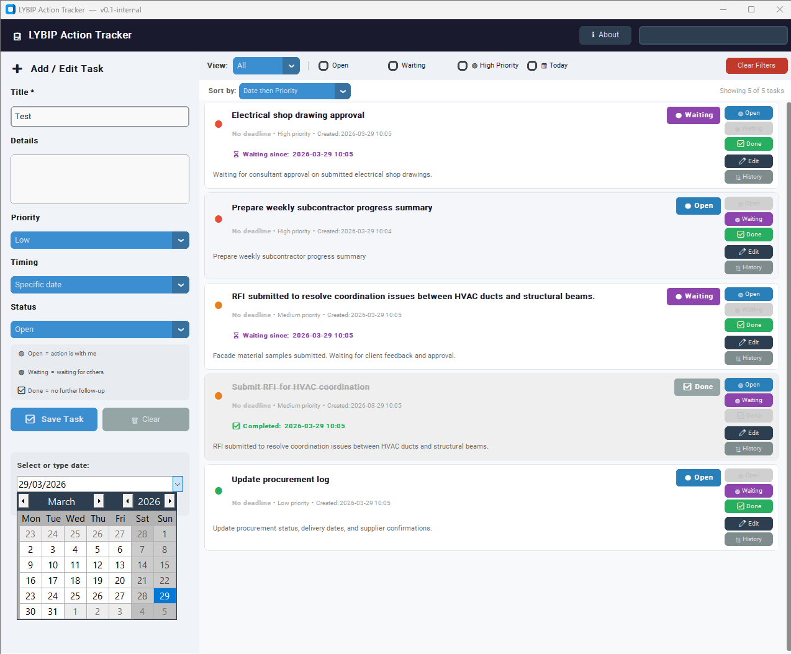

# Project Action Tracker

A lightweight desktop tool designed to track tasks, waiting items, priorities, and daily follow-up actions in a practical work environment.

---

## Preview

---

## Problem

In daily operations, tasks, follow-ups, and responsibilities are often scattered across emails, notes, and conversations. This leads to loss of visibility and weak control over ongoing actions.

---

## Solution

This tool provides a simple and structured way to:

- Track tasks and responsibilities  
- Mark items as *Open*, *Waiting*, or *Done*  
- Assign priorities  
- Monitor waiting durations  
- Keep daily actions organized  

---

## Key Features

- Task creation and editing  
- Status tracking (Open / Waiting / Done)  
- Priority management  
- Waiting tracking  
- Simple and fast interface  

---

## Use Case

Designed for technical office environments where task tracking, coordination, and follow-up are critical.

---

## Author

Ozhan Oruklu
